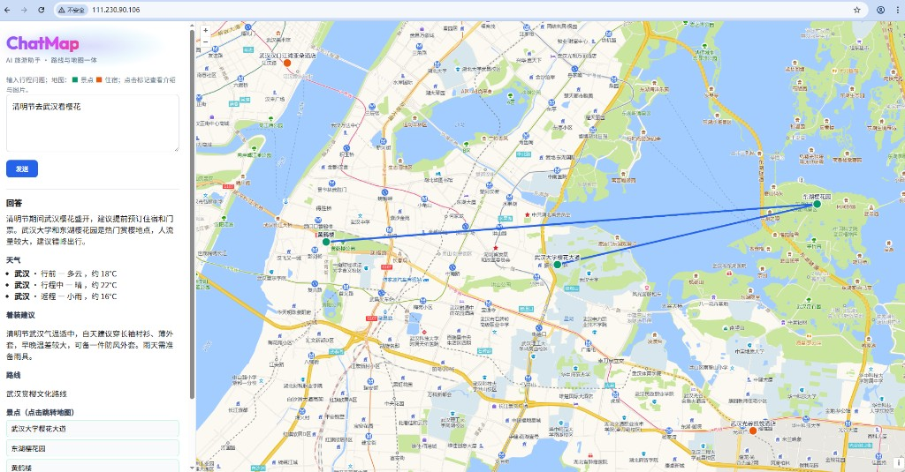
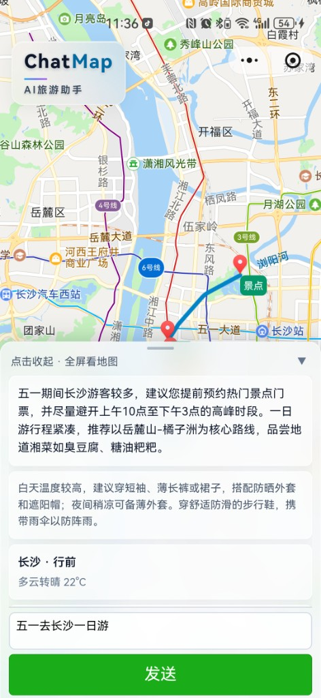

## ChatMap（后端 + Web 前端 + 微信小程序）
## 这是一个纯vibe coding项目
这是一个「AI 旅游助手」项目的仓库，包含三部分：

1. `chat-map-backend`：Spring Boot 后端（为 Web 前端提供 `/api/...` 接口，代管 DeepSeek 调用密钥）
2. `chat-map-frontend`：Web 前端（OpenLayers 地图 + 聊天 UI，向后端请求）
3. `chat-map-uniapp`：微信小程序（默认走云函数 `callTravel` 代管 DeepSeek 密钥；不依赖你自建后端）

---

## 目录结构速览

- `chat-map-backend/`：Java/Spring Boot API + LLM 调用
- `chat-map-frontend/`：Vue + OpenLayers Web 端
- `chat-map-uniapp/`：uni-app 微信小程序
- `deploy/`：服务器上部署 Web+后端的说明与 Nginx 配置

### 界面截图

**Web 端截图**

**小程序截图**

---

## 本地运行（开发/联调）

### 1) Web + 后端

1. 后端（需要 DeepSeek Key，勿写仓库）
   - 打包（生成 jar）：
     - `cd chat-map-backend`
     - `mvn -DskipTests package`
   - 启动（推荐方式：直接带参数）：
     - `java -Dspring.profiles.active=prod -jar target/chat-map-backend-0.0.1-SNAPSHOT.jar --app.llm.api-key=你的DeepSeek密钥`
2. Web 前端：
   - `cd chat-map-frontend`
   - `npm i`
   - `npm run dev`

然后在浏览器打开 Web 地址（Vite 默认端口按实际提示）。

### 2) 微信小程序（uni-app）

1. 编辑 `chat-map-uniapp/src/config.ts`
   - 上线调试：保持 `LLM_MODE='cloud'` 并填写 `WX_CLOUD_ENV_ID`
   - 仅本机调试：可临时改为 `LLM_MODE='direct'`（页面会出现 API Key 输入框，勿用于正式发布）
2. 编译到微信开发者工具：
   - `cd chat-map-uniapp`
   - `npm i`
   - `npm run dev:mp-weixin`

---

## 小程序端（`chat-map-uniapp`）

### 默认上线形态：不在小程序里填 API Key

小程序通过云函数调用 DeepSeek 密钥，密钥只存在云端环境变量中。

关键配置：

- `chat-map-uniapp/src/config.ts`
  - `LLM_MODE`：上线保持 `cloud`
  - `WX_CLOUD_ENV_ID`：填你的云开发环境 ID
- `chat-map-uniapp/src/manifest.json`
  - `mp-weixin.appid`：填你的真实小程序 AppID
  - `mp-weixin.cloudfunctionRoot`：已配置为 `cloudfunctions/`
- 云函数：`chat-map-uniapp/cloudfunctions/callTravel`
  - 前端调用的函数名：`callTravel`
  - 云函数读取环境变量：`DEEPSEEK_API_KEY`

部署步骤建议直接按：`chat-map-uniapp/README.txt`

---

## Web + 后端端（`chat-map-backend` + `chat-map-frontend`）

### 运行参数（DeepSeek Key）

后端的 DeepSeek 密钥不建议写进仓库，需要在启动时传入。

- `chat-map-backend/src/main/resources/application.yml`
  - `app.llm.base-url` 固定为 `https://api.deepseek.com/v1/chat/completions`
  - `app.llm.api-key` 默认空

部署文档里给出了三种传参方式，其中推荐 systemd 环境变量：

- `deploy/chatmap.env.example`
  - `APP_LLM_API_KEY=你的DeepSeek密钥`
  - Spring 会把它绑定到 `app.llm.api-key`

完整部署步骤按：`deploy/README.txt`

---

## 云端/服务器部署（推荐直接参考 deploy 目录）

Web+后端部署逻辑：

- Nginx 监听 `80`
- 静态托管 Web `dist/`
- `/api/` 反代到本机 `127.0.0.1:8080` 的 Spring Boot

参考：

- `deploy/README.txt`
- `deploy/nginx-chatmap.conf`（非 Docker 场景）
- `deploy/nginx-chatmap.docker.conf`（Docker 场景）

---

## 开发/自测常见清单

### 后端联调（Web）

1. 后端能正常启动（监听 `8080`，生产 profile 下建议使用 `0.0.0.0`）
2. Web 访问 `http://你的IP/` 能打开地图与聊天
3. Web 请求为相对路径 `/api/...`（无需额外配置 CORS/代理，取决于实际部署）

### 小程序联调

1. `src/manifest.json` 填好 `appid`
2. `src/config.ts` 填好 `WX_CLOUD_ENV_ID`
3. 云函数 `callTravel` 已部署并配置好 `DEEPSEEK_API_KEY`
4. 小程序处于 `LLM_MODE='cloud'` 时不应出现 API Key 输入框

---

## 备注：为什么小程序不需要你的后端？

`chat-map-uniapp` 默认走的是 `wx.cloud.callFunction('callTravel')`，云函数直接请求 DeepSeek，所以它不依赖你的 Spring Boot 后端。

如果你也需要「Web / 小程序 / 后端」同一套接口调用口径，再在后续版本里做聚合（比如统一走后端 `/api`）即可。

